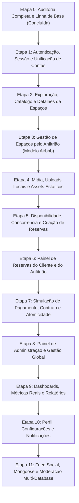

# 📊 Matriz de Paridade Funcional — AgendaSpace (Etapa 0)

> **Documento:** Matriz de Rastreabilidade e Paridade Funcional  
> **Referência Comparativa:**  
> - Vídeo de demonstração oficial do AgendaSpace  
> - Código pré-migração (`0c94127205e6c0f13d9e50ddc98a705f7ceaf314` - Supabase SPA)  
> - Código atual (NestJS + MySQL/Prisma + MongoDB/Mongoose + React 18)  
> **Classificações de Estado:**  
> - 🔴 **Funcionava e regrediu:** Funcionava no projeto original e sofreu regressão ou quebra durante a migração.  
> - 🟡 **Parcial no projeto atual:** Implementado em parte na nova arquitetura, mas com lacunas ou inconsistências.  
> - ⚪ **Já incompleta antes:** Funcionalidade que já não possuía suporte pleno ou consistência no código legado.

---

## 1. Visão Geral da Matriz de Funcionalidades

| # | Funcionalidade | Classificação | Estado Atual | Etapa de Correção |
|---|----------------|---------------|--------------|-------------------|
| 1 | **Cadastro, Login, Logout e Sessão** | 🟡 Parcial no projeto atual | Migrado para NestJS/JWT; payload e alias pendentes | Etapa 1 |
| 2 | **Explorar Espaços e Filtros** | 🟡 Parcial no projeto atual | Filtros ocorrem apenas no client-side em memória | Etapa 2 |
| 3 | **Detalhes do Espaço** | ⚪ Já incompleta antes | Sem rota dedicada `/spaces/:id` para link direto | Etapa 2 |
| 4 | **Anunciar, Editar, Desativar e Reativar Espaços** | 🔴 Funcionava e regrediu | Usuário comum bloqueado na rota de gestão pelo frontend | Etapa 3 |
| 5 | **Upload de Imagens e Mídia** | 🟡 Parcial no projeto atual | Backend operacional; integração do Feed incompleta | Etapa 4 |
| 6 | **Disponibilidade de Horários e Calendário** | 🔴 Funcionava e regrediu | `PENDING` está bloqueando disponibilidade incorretamente | Etapa 5 |
| 7 | **Solicitação de Reserva (Cliente)** | 🟡 Parcial no projeto atual | Formulário funcional; checagem TOCTOU sem atomicidade | Etapa 5 |
| 8 | **Minhas Reservas e Detalhes** | 🟡 Parcial no projeto atual | Mistura reservas de cliente com reservas de anfitrião | Etapa 6 |
| 9 | **Cancelamento de Reservas** | 🟡 Parcial no projeto atual | Operacional; falta validação de antecedência no backend | Etapa 6 |
| 10 | **Pagamento (PIX/Cartão) e Contrato** | 🔴 Funcionava e regrediu | Cliente recebe 403 ao confirmar pagamento; falta atomicidade | Etapa 7 |
| 11 | **Reservas Recebidas pelo Anfitrião** | ⚪ Já incompleta antes | Inexistente na interface para anfitriões da conta única | Etapa 6 |
| 12 | **Gestão Global de Reservas e Usuários (Admin)** | 🟡 Parcial no projeto atual | Operacional para ADMIN; faltam filtros por anfitrião | Etapa 8 |
| 13 | **Dashboards e Relatórios** | 🔴 Funcionava e regrediu | Métricas artificiais e ausência de endpoints analíticos | Etapa 9 |
| 14 | **Gerenciamento de Perfil do Usuário** | 🟡 Parcial no projeto atual | Salva nome/email/avatar; campos bio/phone não persistem | Etapa 10 |
| 15 | **Feed da Comunidade e Moderação Multi-Database** | ⚪ Já incompleta antes (Frontend) | Backend com Mongoose pronto; frontend 100% estático/mock | Etapa 11 |

---

## 2. Inventário Detalhado por Funcionalidade

---

### 1. Cadastro / Login / Logout / Sessão
- **Fonte da Evidência:** Vídeo de demonstração; código antigo `src/components/auth/LoginForm.tsx`, `RegisterForm.tsx`; código atual [src/auth/](file:///c:/Users/User/Documents/AgendaSpace/src/auth), [src/contexts/AuthContext.tsx](file:///c:/Users/User/Documents/AgendaSpace/src/contexts/AuthContext.tsx).
- **Tela / Ação:** Telas `/login` e `/register`; botão Sair no menu de perfil do Header.
- **Endpoint:** `POST /auth/register`, `POST /auth/login`, `GET /auth/me`.
- **DTO / Resposta:**
  - `RegisterDto`: `{ email: string, password: string, fullName: string, role?: 'ADMIN' | 'USER' }`.
  - `LoginDto`: `{ email: string, password: string }`.
  - Resposta: `{ access_token: string, user: { id: string, email: string, fullName: string, role: string, avatarUrl: string | null } }`.
- **Persistência:** MySQL tabela `users` via Prisma. Senha hasheada com bcrypt (10 rounds).
- **Autorização:** Pública para registro e login; `JwtAuthGuard` para `/auth/me`.
- **Estado Atual:** 🟡 **Parcial no projeto atual.**
- **Falha / Bloqueio:**
  1. O payload do token JWT gerado em `AuthService` contém apenas `{ sub, email }`, não gravando `role`. Isso obriga o `JwtStrategy` a consultar o banco MySQL a cada requisição autenticada.
  2. O `AuthContext` não expõe o alias `profile` (esperado por componentes legados remanescentes).
- **Arquivos Afetados:**
  - [src/auth/auth.service.ts](file:///c:/Users/User/Documents/AgendaSpace/src/auth/auth.service.ts)
  - [src/auth/strategies/jwt.strategy.ts](file:///c:/Users/User/Documents/AgendaSpace/src/auth/strategies/jwt.strategy.ts)
  - [src/contexts/AuthContext.tsx](file:///c:/Users/User/Documents/AgendaSpace/src/contexts/AuthContext.tsx)
  - [src/components/auth/RegisterForm.tsx](file:///c:/Users/User/Documents/AgendaSpace/src/components/auth/RegisterForm.tsx)
- **Etapa de Correção:** **Etapa 1** (Autenticação, Sessão e Unificação de Contas).

---

### 2. Explorar Espaços e Filtros
- **Fonte da Evidência:** Vídeo de demonstração (seção "Exploração de Espaços"); código antigo `src/pages/user/Spaces.tsx` (consultava `supabase.from('spaces')`); código atual [src/pages/user/Spaces.tsx](file:///c:/Users/User/Documents/AgendaSpace/src/pages/user/Spaces.tsx), [src/lib/spaces.api.ts](file:///c:/Users/User/Documents/AgendaSpace/src/lib/spaces.api.ts).
- **Tela / Ação:** Página `/spaces` e widget de espaços no `/dashboard`. Filtro por busca textual (nome/descrição), slider de capacidade (1 a 100), slider de preço/hora (R$ 0 a R$ 500) e select de recursos (`wifi`, `projetor`, `ar-condicionado`, etc.).
- **Endpoint:** `GET /spaces?activeOnly=true`.
- **DTO / Resposta:** Array de `Space` (`id`, `name`, `description`, `capacity`, `pricePerHour`, `resources`, `imageUrl`, `isActive`, `createdBy`).
- **Persistência:** MySQL tabela `spaces` via Prisma.
- **Autorização:** Rota pública no backend; rota protegida no frontend por `<ProtectedRoute>`.
- **Estado Atual:** 🟡 **Parcial no projeto atual.**
- **Falha / Bloqueio:**
  1. O backend só suporta o parâmetro `activeOnly`, não aceitando filtros de busca (`search`, `minCapacity`, `maxPrice`, `resource`) via query params no banco.
  2. O frontend carrega todos os espaços em um único request e filtra no cliente via JavaScript, o que se torna inviável para bases de dados reais com centenas de espaços.
- **Arquivos Afetados:**
  - [src/spaces/spaces.controller.ts](file:///c:/Users/User/Documents/AgendaSpace/src/spaces/spaces.controller.ts)
  - [src/spaces/spaces.service.ts](file:///c:/Users/User/Documents/AgendaSpace/src/spaces/spaces.service.ts)
  - [src/pages/user/Spaces.tsx](file:///c:/Users/User/Documents/AgendaSpace/src/pages/user/Spaces.tsx)
- **Etapa de Correção:** **Etapa 2** (Exploração, Catálogo e Detalhes de Espaços).

---

### 3. Detalhes do Espaço
- **Fonte da Evidência:** Código antigo `Dialog` em `Spaces.tsx`; código atual [src/pages/user/Spaces.tsx](file:///c:/Users/User/Documents/AgendaSpace/src/pages/user/Spaces.tsx), endpoint `GET /spaces/:id`.
- **Tela / Ação:** Clique no card de espaço em `/spaces` ou `/dashboard`, disparando modal com galeria de fotos, capacidade, lista completa de recursos, preço e anfitrião.
- **Endpoint:** `GET /spaces/:id`.
- **DTO / Resposta:** Objeto `Space` com `createdBy: { id, fullName, email }`.
- **Persistência:** MySQL tabela `spaces`.
- **Autorização:** Pública.
- **Estado Atual:** ⚪ **Já incompleta antes.**
- **Falha / Bloqueio:** O sistema não possui uma rota web dedicada (ex: `/spaces/:id`) para exibição de detalhes. O detalhe existe apenas como estado volátil dentro do modal na lista de espaços, impossibilitando links diretos ou compartilhamento de URL.
- **Arquivos Afetados:**
  - [src/pages/user/Spaces.tsx](file:///c:/Users/User/Documents/AgendaSpace/src/pages/user/Spaces.tsx)
  - [src/App.tsx](file:///c:/Users/User/Documents/AgendaSpace/src/App.tsx)
- **Etapa de Correção:** **Etapa 2** (Exploração, Catálogo e Detalhes de Espaços).

---

### 4. Anunciar / Editar / Desativar / Reativar Espaços (Anfitrião - Modelo Airbnb)
- **Fonte da Evidência:** Vídeo de demonstração ("Gestão de Espaços"); código antigo `src/pages/admin/Spaces.tsx`; código atual [src/pages/admin/Spaces.tsx](file:///c:/Users/User/Documents/AgendaSpace/src/pages/admin/Spaces.tsx), [src/spaces/](file:///c:/Users/User/Documents/AgendaSpace/src/spaces).
- **Tela / Ação:** Botão "Novo Espaço", Sheet lateral com formulário (nome, capacidade, preço/hora, recursos, upload de foto), dropdown com "Editar", "Desativar" (soft delete) e toggle de ativação.
- **Endpoint:** `POST /spaces`, `PATCH /spaces/:id`, `DELETE /spaces/:id`.
- **DTO / Resposta:**
  - `CreateSpaceDto`: `{ name: string, description?: string, capacity: number, pricePerHour: number, resources?: string[], imageUrl?: string, isActive?: boolean }`.
  - `UpdateSpaceDto`: `Partial<CreateSpaceDto>`.
- **Persistência:** MySQL tabela `spaces`, relacionando `created_by` com `User.id`.
- **Autorização:**
  - Backend: `@UseGuards(JwtAuthGuard)` no `create` (qualquer usuário logado). No `update` e `remove`, valida `space.createdById !== userId && role !== 'ADMIN'`.
  - Frontend: **BLOQUEIO!** A rota `/admin/spaces` em `App.tsx` possui `<ProtectedRoute requireAdmin>`.
- **Estado Atual:** 🟢 **Concluído e verificado na Etapa 2.**
- **Solução Implementada:**
  1. No Modelo Airbnb, qualquer usuário autenticado pode anunciar e gerenciar espaços através da rota `/my-spaces` (`HostMySpaces` que renderiza `AdminSpaces mode="host"`).
  2. O backend fornece `GET /spaces/mine` consultando estritamente por `createdById: userId` do token JWT.
  3. No `Header.tsx`, o menu do usuário comum agora aponta: Explorar (`/spaces`), Minhas Reservas (`/my-bookings`), Meus Espaços (`/my-spaces`), Reservas Recebidas (`/host/bookings`), Feed (`/feed`).
  4. Rotas `/admin/*` continuam estritamente restritas aos usuários com papel `ADMIN`. Redirecionamentos legados criados para `/host/spaces` -> `/my-spaces`.
  5. Autorização por propriedade no backend: `SpacesService.update` e `SpacesService.remove` bloqueiam tentativas de alteração em espaços de outros anfitriões com HTTP 403 Forbidden.
- **Arquivos Atualizados:**
  - [src/App.tsx](file:///c:/Users/User/Documents/AgendaSpace/src/App.tsx)
  - [src/components/layout/Header.tsx](file:///c:/Users/User/Documents/AgendaSpace/src/components/layout/Header.tsx)
  - [src/pages/host/MySpaces.tsx](file:///c:/Users/User/Documents/AgendaSpace/src/pages/host/MySpaces.tsx)
  - [src/pages/host/ReceivedBookings.tsx](file:///c:/Users/User/Documents/AgendaSpace/src/pages/host/ReceivedBookings.tsx)
  - [src/pages/admin/Spaces.tsx](file:///c:/Users/User/Documents/AgendaSpace/src/pages/admin/Spaces.tsx)
  - [src/spaces/spaces.controller.ts](file:///c:/Users/User/Documents/AgendaSpace/src/spaces/spaces.controller.ts)
  - [src/spaces/spaces.service.ts](file:///c:/Users/User/Documents/AgendaSpace/src/spaces/spaces.service.ts)
- **Etapa de Correção:** **Etapa 2** (Concluída).

---

### 5. Upload de Imagens e Mídia
- **Fonte da Evidência:** Vídeo de demonstração; código antigo usava Supabase Storage (`supabase.storage.from('spaces')`); código atual [src/upload/](file:///c:/Users/User/Documents/AgendaSpace/src/upload), [src/hooks/useFileUpload.ts](file:///c:/Users/User/Documents/AgendaSpace/src/hooks/useFileUpload.ts).
- **Tela / Ação:** Upload de fotos de espaços no Sheet de criação/edição; upload de foto de avatar em `/settings`; upload de imagem para o Feed.
- **Endpoint:** `POST /upload/:bucket` (onde `bucket` ∈ `['spaces', 'avatars', 'feed']`).
- **DTO / Resposta:** Multipart form data com campo `file`. Resposta: `{ url: string }` (ex: `/uploads/spaces/1727731200000-foto.jpg`).
- **Persistência:** Sistema de arquivos local em `public/uploads/:bucket`, servido via `ServeStaticModule` no NestJS.
- **Autorização:** `JwtAuthGuard` (usuário autenticado).
- **Estado Atual:** 🟡 **Parcial no projeto atual.**
- **Falha / Bloqueio:**
  1. Em `Settings.tsx`, a imagem do avatar é enviada com sucesso, mas a URL retornada é relativa (`/uploads/avatars/...`), necessitando tratamento da base da API quando o frontend roda em porta desacoplada (8080 vs 3000).
  2. Em `NewPostInput.tsx` (Feed), o upload de imagens ainda usa manipulação de estado simulada sem acoplamento ao endpoint real.
- **Arquivos Afetados:**
  - [src/upload/upload.controller.ts](file:///c:/Users/User/Documents/AgendaSpace/src/upload/upload.controller.ts)
  - [src/upload/upload.service.ts](file:///c:/Users/User/Documents/AgendaSpace/src/upload/upload.service.ts)
  - [src/hooks/useFileUpload.ts](file:///c:/Users/User/Documents/AgendaSpace/src/hooks/useFileUpload.ts)
  - [src/components/feed/NewPostInput.tsx](file:///c:/Users/User/Documents/AgendaSpace/src/components/feed/NewPostInput.tsx)
- **Etapa de Correção:** **Etapa 4** (Mídia, Uploads Locais e Assets Estáticos).

---

### 6. Disponibilidade de Horários e Calendário
- **Fonte da Evidência:** Código antigo `BookingForm.tsx`; código atual [src/bookings/bookings.service.ts](file:///c:/Users/User/Documents/AgendaSpace/src/bookings/bookings.service.ts#L142), [src/components/booking/BookingForm.tsx](file:///c:/Users/User/Documents/AgendaSpace/src/components/booking/BookingForm.tsx).
- **Tela / Ação:** Seleção de data no DatePicker e exibição dos horários ocupados/disponíveis no formulário de reserva.
- **Endpoint:** `GET /bookings/space/:spaceId?date=YYYY-MM-DD`.
- **DTO / Resposta:** Array de `{ id: string, startDatetime: string, endDatetime: string, status: BookingStatus }`.
- **Persistência:** MySQL tabela `bookings`.
- **Autorização:** `JwtAuthGuard`.
- **Estado Atual:** 🔴 **Funcionava e regrediu.**
- **Falha / Bloqueio:** **ERRO CRÍTICO DE REGRA DE NEGÓCIO.**
  Em [BookingsService.findBySpace](file:///c:/Users/User/Documents/AgendaSpace/src/bookings/bookings.service.ts#L146), a query busca:
  ```ts
  status: { in: [BookingStatusEnum.CONFIRMED, BookingStatusEnum.PENDING] }
  ```
  A especificação do projeto afirma: **"PENDING não bloqueia disponibilidade. Confirmar deve impedir conflitos de forma atômica."** O código atual bloqueia o calendário para qualquer intenção de reserva pendente, impedindo outros usuários de reservarem e gerando falsa indisponibilidade.
- **Arquivos Afetados:**
  - [src/bookings/bookings.service.ts](file:///c:/Users/User/Documents/AgendaSpace/src/bookings/bookings.service.ts#L146)
  - [src/components/booking/BookingForm.tsx](file:///c:/Users/User/Documents/AgendaSpace/src/components/booking/BookingForm.tsx)
- **Etapa de Correção:** **Etapa 5** (Disponibilidade, Concorrência e Criação de Reservas).

---

### 7. Solicitar Reserva (Fluxo do Cliente)
- **Fonte da Evidência:** Vídeo de demonstração ("Sistema de Reservas"); código antigo `BookingForm.tsx`; código atual [src/components/booking/BookingForm.tsx](file:///c:/Users/User/Documents/AgendaSpace/src/components/booking/BookingForm.tsx), [src/bookings/](file:///c:/Users/User/Documents/AgendaSpace/src/bookings).
- **Tela / Ação:** Modal aberto a partir do card de espaço. Preenchimento de data, horário de início, horário de término, notas opcionais; visualização do cálculo automático de valor total.
- **Endpoint:** `POST /bookings`.
- **DTO / Resposta:**
  - `CreateBookingDto`: `{ spaceId: string, startDatetime: string, endDatetime: string, notes?: string }`.
  - Resposta: `Booking` criado com status inicial `PENDING`, `totalPrice` calculado com base na tarifa por hora e duração.
- **Persistência:** MySQL tabela `bookings`.
- **Autorização:** `JwtAuthGuard`.
- **Estado Atual:** 🟡 **Parcial no projeto atual.**
- **Falha / Bloqueio:**
  1. A validação de conflito de datas no backend `BookingsService.create` utiliza `findFirst` seguido de `create` sem transação, permitindo condição de corrida se dois clientes solicitarem simultaneamente.
  2. As mensagens de erro retornadas pelo backend precisam de sanitização consistente no frontend para casos de data no passado ou formato ISO incompleto.
- **Arquivos Afetados:**
  - [src/bookings/bookings.service.ts](file:///c:/Users/User/Documents/AgendaSpace/src/bookings/bookings.service.ts#L27)
  - [src/bookings/dto/create-booking.dto.ts](file:///c:/Users/User/Documents/AgendaSpace/src/bookings/dto/create-booking.dto.ts)
  - [src/components/booking/BookingForm.tsx](file:///c:/Users/User/Documents/AgendaSpace/src/components/booking/BookingForm.tsx)
- **Etapa de Correção:** **Etapa 5** (Disponibilidade, Concorrência e Criação de Reservas).

---

### 8. Minhas Reservas e Detalhes da Reserva
- **Fonte da Evidência:** Vídeo de demonstração ("Minhas Reservas"); código antigo `src/pages/user/MyBookings.tsx`; código atual [src/pages/user/MyBookings.tsx](file:///c:/Users/User/Documents/AgendaSpace/src/pages/user/MyBookings.tsx), [src/lib/bookings.api.ts](file:///c:/Users/User/Documents/AgendaSpace/src/lib/bookings.api.ts).
- **Tela / Ação:** Página `/my-bookings`. Abas "Próximas", "Hoje", "Histórico". Exibição de cards com status, horário, preço e ações.
- **Endpoint:** `GET /bookings`.
- **DTO / Resposta:** Array de `Booking` incluindo relações `space` e `user`.
- **Persistência:** MySQL tabela `bookings`.
- **Autorização:** `JwtAuthGuard` (retorna reservas onde `userId = req.user.id` ou `space.createdById = req.user.id`).
- **Estado Atual:** 🟡 **Parcial no projeto atual.**
- **Falha / Bloqueio:**
  1. O backend retorna no mesmo array tanto as reservas feitas pelo usuário quanto as reservas que o usuário recebeu nos espaços que ele possui como anfitrião.
  2. A tela `MyBookings.tsx` não separa os dois fluxos. Se outra pessoa solicitou o espaço do usuário, o anfitrião vê o card na sua lista com um botão "Pagar para Confirmar", como se fosse o cliente da própria reserva!
  3. O botão de detalhes dispara apenas um toast genérico com texto simples em vez de exibir um modal/painel com resumo completo da reserva.
- **Arquivos Afetados:**
  - [src/pages/user/MyBookings.tsx](file:///c:/Users/User/Documents/AgendaSpace/src/pages/user/MyBookings.tsx)
  - [src/bookings/bookings.service.ts](file:///c:/Users/User/Documents/AgendaSpace/src/bookings/bookings.service.ts#L123)
- **Etapa de Correção:** **Etapa 6** (Painel de Reservas do Cliente e do Anfitrião).

---

### 9. Cancelamento de Reservas
- **Fonte da Evidência:** Vídeo de demonstração; código antigo `MyBookings.tsx`; código atual [src/pages/user/MyBookings.tsx](file:///c:/Users/User/Documents/AgendaSpace/src/pages/user/MyBookings.tsx#L48), [src/bookings/bookings.service.ts](file:///c:/Users/User/Documents/AgendaSpace/src/bookings/bookings.service.ts#L212).
- **Tela / Ação:** Botão "Cancelar" ou "Cancelar Pedido" no card de reserva.
- **Endpoint:** `PATCH /bookings/:id` com `{ status: 'CANCELLED' }`.
- **DTO / Resposta:** `UpdateBookingStatusDto`: `{ status: 'CANCELLED' }`.
- **Persistência:** MySQL tabela `bookings` (`status` passa a `CANCELLED`).
- **Autorização:** Permitido para o cliente (`booking.userId === req.user.id`), dono do espaço (`booking.space.createdById === req.user.id`) ou `ADMIN`.
- **Estado Atual:** 🟡 **Parcial no projeto atual.**
- **Falha / Bloqueio:** A checagem de antecedência mínima (cancelar com mais de 2 horas de antecedência) está implementada apenas no frontend (`canCancelBooking`). O backend não valida a janela temporal, permitindo que uma requisição direta cancele reservas passadas ou já em andamento.
- **Arquivos Afetados:**
  - [src/bookings/bookings.service.ts](file:///c:/Users/User/Documents/AgendaSpace/src/bookings/bookings.service.ts#L212)
  - [src/pages/user/MyBookings.tsx](file:///c:/Users/User/Documents/AgendaSpace/src/pages/user/MyBookings.tsx)
- **Etapa de Correção:** **Etapa 6** (Painel de Reservas do Cliente e do Anfitrião).

---

### 10. Pagamento PIX / Cartão (Simulado Acadêmico) e Contrato
- **Fonte da Evidência:** Vídeo de demonstração (modal com contrato e dados de pagamento); código antigo `PaymentDialog.tsx`; código atual [src/components/booking/PaymentDialog.tsx](file:///c:/Users/User/Documents/AgendaSpace/src/components/booking/PaymentDialog.tsx), [src/bookings/bookings.service.ts](file:///c:/Users/User/Documents/AgendaSpace/src/bookings/bookings.service.ts#L228).
- **Tela / Ação:** Botão "Pagar para Confirmar" em `/my-bookings`. Abre modal com texto do contrato de locação e formulário de pagamento simulado.
- **Endpoint:** `PATCH /bookings/:id` com `{ status: 'CONFIRMED' }`.
- **DTO / Resposta:** `{ status: 'CONFIRMED' }`.
- **Persistência:** MySQL tabela `bookings`. Não armazena dados de cartão nem CVC.
- **Autorização:** **REGRESSÃO CRÍTICA (403 FORBIDDEN)!**
  No backend `BookingsService.updateStatus`:
  ```ts
  if (!isOwnerOfSpace && !isAdmin && (!isClient || dto.status !== BookingStatusEnum.CANCELLED)) {
    throw new ForbiddenException('Você não tem permissão para alterar este status.');
  }
  ```
  Quando o cliente realiza o pagamento simulado e a UI tenta alterar o status de `PENDING` para `CONFIRMED`, o backend rejeita com **403 Forbidden**, pois só permite ao cliente o status `CANCELLED`!
- **Estado Atual:** 🔴 **Funcionava e regrediu.**
- **Falha / Bloqueio:**
  1. O cliente está impossibilitado de confirmar sua reserva após pagar.
  2. Falta a opção de pagamento simulado via PIX com QR Code/cópia-e-cola na interface (atualmente apenas formulário de cartão).
  3. A confirmação não é atômica no banco: dois clientes que tentem pagar simultaneamente por horários sobrepostos podem ambos ter sucesso se a transação não fizer bloqueio pessimista ou serialização com `$transaction`.
- **Arquivos Afetados:**
  - [src/bookings/bookings.service.ts](file:///c:/Users/User/Documents/AgendaSpace/src/bookings/bookings.service.ts#L228)
  - [src/components/booking/PaymentDialog.tsx](file:///c:/Users/User/Documents/AgendaSpace/src/components/booking/PaymentDialog.tsx)
- **Etapa de Correção:** **Etapa 7** (Simulação de Pagamento, Contrato e Atomicidade de Confirmação).

---

### 11. Reservas Recebidas pelo Anfitrião (Gestão Host)
- **Fonte da Evidência:** Requisito de unificação de contas (Modelo Airbnb); consultas já preparadas no backend (`space.createdById = userId`).
- **Tela / Ação:** Painel onde o anfitrião consulta as reservas que outros usuários solicitaram para os seus espaços, aprova ou recusa solicitações pendentes e acompanha faturamento dos seus espaços.
- **Endpoint:** `GET /bookings`, `PATCH /bookings/:id`.
- **DTO / Resposta:** Lista de reservas com dados do cliente e do espaço.
- **Persistência:** MySQL tabela `bookings`.
- **Autorização:** Dono do espaço (`space.createdById = userId`) ou `ADMIN`.
- **Estado Atual:** ⚪ **Já incompleta antes.**
- **Falha / Bloqueio:** A interface do frontend não possui uma aba ou rota dedicada para "Reservas Recebidas" do anfitrião. Essas reservas atualmente aparecem misturadas na tela de "Minhas Reservas" do cliente, sem identificação do locatário.
- **Arquivos Afetados:**
  - [src/pages/user/MyBookings.tsx](file:///c:/Users/User/Documents/AgendaSpace/src/pages/user/MyBookings.tsx)
  - [src/components/layout/Header.tsx](file:///c:/Users/User/Documents/AgendaSpace/src/components/layout/Header.tsx)
- **Etapa de Correção:** **Etapa 6** (Painel de Reservas do Cliente e do Anfitrião).

---

### 12. Gestão Global de Reservas e Usuários (Painel do Administrador)
- **Fonte da Evidência:** Vídeo de demonstração ("Painel do Administrador"); código antigo `admin/Bookings.tsx`, `admin/Users.tsx`; código atual [src/pages/admin/Bookings.tsx](file:///c:/Users/User/Documents/AgendaSpace/src/pages/admin/Bookings.tsx), [src/pages/admin/Users.tsx](file:///c:/Users/User/Documents/AgendaSpace/src/pages/admin/Users.tsx).
- **Tela / Ação:**
  - `/admin/bookings`: Tabela geral de todas as reservas do sistema com filtros por status e data.
  - `/admin/users`: Tabela de todos os usuários com busca e botão de promoção/rebaixamento de role (`ADMIN` ↔ `USER`).
- **Endpoint:** `GET /bookings`, `PATCH /bookings/:id`, `GET /profiles`, `PATCH /profiles/:id`.
- **DTO / Resposta:** `UpdateBookingStatusDto`, `UpdateUserDto` (`role: Role`).
- **Persistência:** MySQL tabelas `bookings` e `users`.
- **Autorização:** `@Roles(Role.ADMIN)` protegido por `RolesGuard`.
- **Estado Atual:** 🟡 **Parcial no projeto atual.**
- **Falha / Bloqueio:** O painel de reservas do administrador não permite filtrar por anfitrião ou espaço específico de forma rápida, e o cancelamento de reservas pelo admin não grava justificativa de cancelamento no banco.
- **Arquivos Afetados:**
  - [src/pages/admin/Bookings.tsx](file:///c:/Users/User/Documents/AgendaSpace/src/pages/admin/Bookings.tsx)
  - [src/pages/admin/Users.tsx](file:///c:/Users/User/Documents/AgendaSpace/src/pages/admin/Users.tsx)
  - [src/users/users.controller.ts](file:///c:/Users/User/Documents/AgendaSpace/src/users/users.controller.ts)
- **Etapa de Correção:** **Etapa 8** (Painel de Administração e Gestão Global).

---

### 13. Dashboards e Relatórios
- **Fonte da Evidência:** Vídeo de demonstração ("Dashboard Geral" e "Relatórios"); código antigo `AdminDashboard.tsx`, `UserDashboard.tsx`, `Reports.tsx`; código atual [src/pages/admin/Reports.tsx](file:///c:/Users/User/Documents/AgendaSpace/src/pages/admin/Reports.tsx), [src/components/dashboard/AdminDashboard.tsx](file:///c:/Users/User/Documents/AgendaSpace/src/components/dashboard/AdminDashboard.tsx).
- **Tela / Ação:**
  - `/dashboard`: Cards de estatísticas de reservas do dia, faturamento mensal, total de espaços e usuários ativos.
  - `/admin/reports`: Abas "Visão Geral", "Reservas" e "Receita" com barras de distribuição por status e listagem dos últimos 7 dias.
- **Endpoint:** Atualmente o frontend consome endpoints crus (`/bookings`, `/profiles`, `/spaces`) e efetua o cálculo em memória no navegador.
- **DTO / Resposta:** Dados brutos das tabelas relacionais.
- **Persistência:** MySQL.
- **Autorização:** `requireAdmin` para admin dashboard e relatórios.
- **Estado Atual:** 🔴 **Funcionava e regrediu.**
- **Falha / Bloqueio:**
  1. No `AdminDashboard.tsx`, existe injeção artificial: `if (spacesData.length > 0) uniqueUserIds.add('owner'); activeUsers: Math.max(uniqueUserIds.size, 1);`.
  2. No `Reports.tsx`, todo o cálculo estatístico é feito no JavaScript do navegador, gerando sobrecarga e inconsistência quando há paginação de dados.
  3. Gráficos analíticos Recharts que existiam no projeto foram simplificados para barras de progresso HTML estáticas.
- **Arquivos Afetados:**
  - [src/components/dashboard/AdminDashboard.tsx](file:///c:/Users/User/Documents/AgendaSpace/src/components/dashboard/AdminDashboard.tsx#L60)
  - [src/pages/admin/Reports.tsx](file:///c:/Users/User/Documents/AgendaSpace/src/pages/admin/Reports.tsx)
- **Etapa de Correção:** **Etapa 9** (Dashboards, Métricas Reais e Relatórios).

---

### 14. Gerenciamento de Perfil do Usuário
- **Fonte da Evidência:** Vídeo de demonstração ("Gerenciamento de Perfil"); código antigo `src/pages/Settings.tsx`; código atual [src/pages/Settings.tsx](file:///c:/Users/User/Documents/AgendaSpace/src/pages/Settings.tsx), [src/users/](file:///c:/Users/User/Documents/AgendaSpace/src/users).
- **Tela / Ação:** Página `/settings`. Edição de Nome Completo, Email, Foto de Perfil (upload de avatar), Bio e Telefone.
- **Endpoint:** `PATCH /profiles/:id`.
- **DTO / Resposta:** `UpdateUserDto`: `{ fullName?: string, email?: string, avatarUrl?: string }`.
- **Persistência:** MySQL tabela `users`.
- **Autorização:** `JwtAuthGuard` (usuário só pode alterar o próprio registro se não for `ADMIN`).
- **Estado Atual:** 🟡 **Parcial no projeto atual.**
- **Falha / Bloqueio:**
  1. A tabela `users` do Prisma não possui colunas para `bio` e `phone`. As informações digitadas nesses campos na tela são descartadas antes do envio para evitar erro de whitelist no NestJS.
  2. Ao salvar o perfil, os dados atualizados não são propagados de imediato para o `AuthContext` do frontend sem reload.
- **Arquivos Afetados:**
  - [src/pages/Settings.tsx](file:///c:/Users/User/Documents/AgendaSpace/src/pages/Settings.tsx)
  - [src/users/users.service.ts](file:///c:/Users/User/Documents/AgendaSpace/src/users/users.service.ts)
  - [prisma/schema.prisma](file:///c:/Users/User/Documents/AgendaSpace/prisma/schema.prisma)
- **Etapa de Correção:** **Etapa 10** (Perfil, Configurações e Notificações).

---

### 15. Feed da Comunidade: Publicações, Curtidas, Comentários e Moderação Multi-Database
- **Fonte da Evidência:** Requisito de banco de dados NoSQL MongoDB integrado com validação relacional MySQL; código atual [src/feed/](file:///c:/Users/User/Documents/AgendaSpace/src/feed) (backend) e [src/pages/Feed.tsx](file:///c:/Users/User/Documents/AgendaSpace/src/pages/Feed.tsx) (frontend).
- **Tela / Ação:** Página `/feed`. Publicação de foto associada a um espaço selecionado, visualização do feed com contagem de curtidas e últimos 3 comentários, ação de curtir/descurtir (toggle), envio de novo comentário e moderação (exclusão por autor, dono do espaço ou admin).
- **Endpoint:**
  - `POST /feed/posts`
  - `GET /feed/spaces/:spaceId`
  - `POST /feed/posts/:postId/like`
  - `POST /feed/posts/:postId/comments`
  - `DELETE /feed/posts/:postId`
  - `DELETE /feed/comments/:commentId`
- **DTO / Resposta:** `CreatePostDto`, `CreateCommentDto`; agregação MongoDB projetando `likesCount` e `recentComments`.
- **Persistência:**
  - **NoSQL:** MongoDB com coleções `posts`, `comments`, `likes`.
  - **Relacional:** MySQL com validação via Prisma da existência do espaço (`space.id`) e verificação de propriedade (`space.createdById`) para autorização de moderação.
- **Autorização:** A moderação exige que o usuário logado seja o autor do post/comentário, o proprietário do espaço no MySQL (`space.createdById === req.user.id`) ou `ADMIN`.
- **Estado Atual:** ⚪ **Já incompleta antes no frontend / Backend completo.**
- **Falha / Bloqueio:** O frontend [src/pages/Feed.tsx](file:///c:/Users/User/Documents/AgendaSpace/src/pages/Feed.tsx) está completamente desacoplado da API:
  1. Utiliza constantes em memória `INITIAL_POSTS` e `MOCK_SPACES`.
  2. Curtir apenas altera o contador React local, sem persistir no MongoDB.
  3. Comentar e publicar apenas adiciona ao array estático.
  4. Falta no backend um endpoint para feed global (ex: `GET /feed` trazendo todos os posts recentes de espaços ativos), pois atualmente só existe `GET /feed/spaces/:spaceId`.
- **Arquivos Afetados:**
  - [src/pages/Feed.tsx](file:///c:/Users/User/Documents/AgendaSpace/src/pages/Feed.tsx)
  - [src/components/feed/NewPostInput.tsx](file:///c:/Users/User/Documents/AgendaSpace/src/components/feed/NewPostInput.tsx)
  - [src/feed/feed.controller.ts](file:///c:/Users/User/Documents/AgendaSpace/src/feed/feed.controller.ts)
  - [src/feed/feed.service.ts](file:///c:/Users/User/Documents/AgendaSpace/src/feed/feed.service.ts)
- **Etapa de Correção:** **Etapa 11** (Feed Social, Mongoose e Moderação Multi-Database).

---

## 3. Plano Sequencial de Recuperação por Etapas

As 15 funcionalidades auditadas foram organizadas no plano de execução sequencial a seguir:



- **Etapa 0 (Atual):** Auditoria integral do código, validação de compilação sem mutação de banco de dados e elaboração dos documentos diagnósticos.
- **Etapa 1:** Ajustar payload JWT (`role`), resolver compatibilidade de perfis e consolidar modelo Airbnb sem resíduos de `TENANT`.
- **Etapa 2:** Implementar filtros de catálogo no backend e rota dedicada de detalhes.
- **Etapa 3:** Liberar gestão de espaços para usuários comuns em `App.tsx` e `Header.tsx`, separando "Meus Espaços" da visão global de Admin.
- **Etapa 4:** Normalizar URLs absolutas/relativas de upload e integrar componentes remanescentes.
- **Etapa 5:** Corrigir regra de disponibilidade (`PENDING` não bloqueia) e adicionar validação cronológica e de atomicidade.
- **Etapa 6:** Criar visualização de "Reservas Recebidas" para anfitriões e separar claramente as reservas feitas das reservas recebidas.
- **Etapa 7:** Corrigir autorização de confirmação pelo cliente após pagamento simulado (remover bloqueio 403) e implementar transação atômica contra concorrência.
- **Etapa 8:** Refinar filtros e ações administrativas com auditoria e motivos de cancelamento.
- **Etapa 9:** Substituir métricas artificiais por agregações analíticas reais no backend e gráficos no frontend.
- **Etapa 10:** Alinhar schema de perfil com campos do formulário e re-hidratação de sessão.
- **Etapa 11:** Conectar a tela do Feed aos endpoints reais do NestJS/MongoDB Mongoose com suporte a moderação multi-database.
